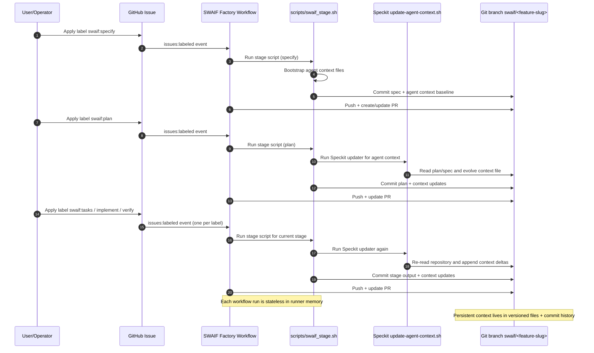

# SWAIF Project Automation Mapping

RepoName: <REPLACE_WITH_THIS_REPO_NAME>

ProjectStatusFieldValues: <REPLACE_WITH_YOUR_PROJECT_STATUS_VALUES>

## Exact Status -> Label mapping

- Intake Ready -> (no stage label; ready for operator triage)
- Specify In Progress -> `swaif:specify`
- Plan In Progress -> `swaif:plan`
- Tasks In Progress -> `swaif:tasks`
- Implement In Progress -> `swaif:implement`
- Verify -> `swaif:verify`
- Done -> (no stage label; closeout state)
- Blocked -> `swaif:blocked` (optional)

## Operator loop

1. Move card in Project to a stage status.
2. Apply matching `swaif:*` label on the issue.
3. Workflow runs exactly one SWAIF stage.
4. Workflow updates/creates PR from `swaif/<feature-slug>` to `main`.
5. If failed, workflow adds `swaif:blocked` and comments next steps.
6. Operator fixes metadata/content and moves forward.

## SWAIF + Speckit stage sequence

## Context persistence rules

- The runner does not keep memory between workflow runs.
- Context continuity is guaranteed by committed files in the feature branch.
- The main persisted context files are:
	- `.github/agents/copilot-instructions.md`
	- `.specify/templates/agent-file-template.md`
	- `specs/<feature-slug>/spec.md`, `plan.md`, `tasks.md`
- Because each stage commits and pushes, the next label starts from the exact prior context snapshot.
