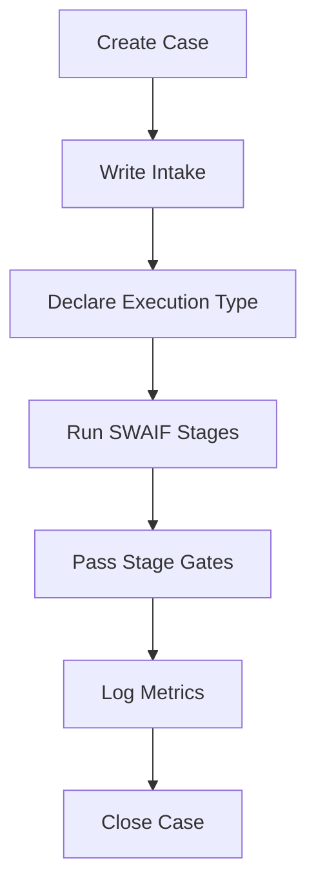

# SWAIF Runbook
## How to Start and Execute a SWAIF Case

This document defines the operational procedure for running SWAIF inside this repository.

It is the single entry point for initiating structured execution.

---

# 1. Purpose

The Runbook ensures that:

- Every case follows the SWAIF discipline
- Governance is respected
- Execution type is declared
- Traceability is preserved
- Auditability is guaranteed

No execution should begin outside this process.

---

# 2. Before You Start

Confirm the following:

- [ ] Repository was created from `swaif-execution-template`
- [ ] `.swaif/engine/` is present
- [ ] Execution type is selected (see EXECUTION_TYPES.md)
- [ ] Scope is clearly described
- [ ] Stakeholders are identified

If any item above is missing, stop and fix it first.

---

# 3. Create a New Case

Create a new directory:

cases/<case-id>/

Example:

cases/clinic-finance-module/

Inside the folder, create:

intake.md

---

# 4. Write the Intake

The intake must include:

- Execution Type
- Business Context
- Problem Description
- Constraints
- Non-Goals
- Risk Level
- Stakeholders

Minimum required declaration:

Execution Type: <Hands-On | Research | Prototype | PoC | MVP | Scaled Product>

Execution cannot proceed without this declaration.

Commit intake before continuing.

---

# 5. Run SWAIF Stages

Execution follows the stage-gated model:

1. Specify
2. Plan
3. Tasks
4. Implement
5. Validate

Each stage must produce its corresponding artifact:

| Stage      | Artifact          |
|------------|-------------------|
| Specify    | spec.md           |
| Plan       | plan.md           |
| Tasks      | tasks.md          |
| Implement  | code + PR         |
| Validate   | execution-log.md  |

No stage may be skipped.

---

# 6. Stage Gate Rules

Before advancing:

- Acceptance criteria must be measurable
- Tasks must map to AC IDs
- Plan must respect constraints
- Constitution-sensitive areas require review

Failure to meet gate conditions blocks progression.

---

# 7. Logging Requirements

Each case must include:

cases/<case-id>/execution-log.md

The log must capture:

- Start date
- Completion date
- Drift occurrences
- Rework cycles
- Metrics (if applicable)
- Observations
- Lessons learned

For Research or MVP+ types, metrics tracking is mandatory.

---

# 8. Completion Criteria

A case is considered complete when:

- All acceptance criteria are satisfied
- Stage gates are passed
- Execution log is finalized
- Deployment readiness (if applicable) is documented
- Summary section is written

No case is closed without documentation.

---

# 9. Research Mode Addendum

If execution type = Research:

- Acceptance criteria must be frozen
- No scope changes allowed after freeze
- Dataset must be exported
- Deviations must be logged

Experimental integrity overrides speed.

---

# 10. Healthcare Compliance Reminder

For clinic-related executions:

- Do not commit patient data
- Do not store identifiable health records
- Follow LGPD principles
- Document compliance notes if handling integrations

This repository is a factory, not a data storage system.

---

# 11. Design Philosophy

SWAIF is not "vibe coding with structure."

It is disciplined, specification-driven execution.

Speed without precision is risk.
Precision without structure is illusion.

This runbook ensures both.

---

# 12. Summary Workflow

This runbook is mandatory for all SWAIF execution repositories.
