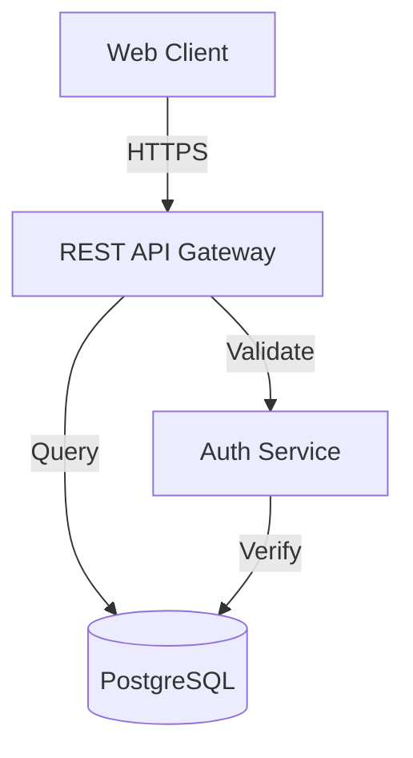
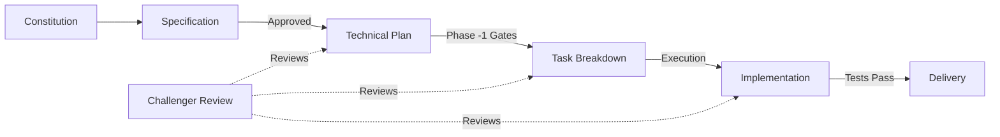

# SWAIF Templates

This directory contains production-ready templates for implementing the SWAIF (Software Factory) development framework. These templates enforce constitutional compliance, traceability, and stage gate discipline throughout the software development lifecycle.

## Overview of Templates

| Template | Purpose | When to Use | Output |
|----------|---------|-------------|--------|
| **swaif-constitution.md** | Define factory governance and engineering principles | At project inception, before any development | Project constitution |
| **swaif-spec-template.md** | Capture requirements and user stories | Phase 0 - Before technical planning | Approved specification |
| **swaif-plan-template.md** | Design architecture and technical approach | Phase -1 - After spec approval | Technical plan |
| **swaif-tasks-template.md** | Break down work into executable tasks | Phase 0 - After plan approval | Task list with dependencies |

## Template Usage Guide

### 1. swaif-constitution.md

**Purpose**: Establishes the governing principles, engineering practices, and compliance requirements for your software factory.

**When to Use**: 
- At the start of a new project or initiative
- When establishing team standards
- Before creating any specifications or plans

**How to Use**:
1. Copy the template to your project root as `CONSTITUTION.md`
2. Review each Article and customize enforcement levels (MUST/SHOULD/MAY)
3. Add project-specific governance rules
4. Have the team review and approve
5. Version control and reference in all future documents

**Customization Guidelines**:
- Adjust enforcement language based on project risk (MUST vs SHOULD)
- Add domain-specific articles (e.g., compliance, performance)
- Define your amendment process clearly
- Specify who has constitutional authority
- Document exceptions process

**Example**:
```markdown
# MyProject Software Factory Constitution
Version: 1.0.0
Effective Date: 2024-01-15
Authority: Engineering Lead + Tech Lead

[Customized articles follow...]
```

---

### 2. swaif-spec-template.md

**Purpose**: Captures functional requirements, user stories, acceptance criteria, and constitutional compliance checklist.

**When to Use**:
- Phase 0 of SWAIF lifecycle
- When stakeholders request new features
- Before any technical design work begins
- When requirements need formal approval

**How to Use**:
1. Copy template to `specs/SPEC-NNNN.md` (use sequential numbering)
2. Fill in YAML frontmatter with factory metadata
3. Complete constitutional compliance checklist
4. Write user stories with clear acceptance criteria
5. Document non-functional requirements
6. Assess risks and dependencies
7. Get stakeholder approval signatures
8. Reference this spec in all downstream documents

**Customization Guidelines**:
- Add domain-specific frontmatter fields (e.g., `compliance_frameworks`)
- Include custom risk categories relevant to your domain
- Add project-specific NFR categories
- Customize approval workflow to match your organization
- Add links to related specifications

**Example User Story**:
```markdown
### US-001: User Login

**As a** registered user  
**I want to** log in with email and password  
**So that** I can access my personalized dashboard

**Acceptance Criteria**:
- ✅ User can enter email and password
- ✅ System validates credentials against database
- ✅ Failed login shows error message
- ✅ Successful login redirects to dashboard
- ✅ Session expires after 30 minutes

**Constitutional Compliance**: Article I (Traceability), Article III (Test-First)
```

---

### 3. swaif-plan-template.md

**Purpose**: Defines technical architecture, data models, API contracts, and integration strategy.

**When to Use**:
- Phase -1 of SWAIF lifecycle (after spec approval)
- When designing system architecture
- Before task breakdown
- When planning integration points

**How to Use**:
1. Copy template to `plans/PLAN-NNNN.md` (matches spec number)
2. Link to parent specification in frontmatter
3. Complete Phase -1 gates (Simplicity, Anti-Abstraction, Integration-First)
4. Create architecture diagrams using Mermaid
5. Define data models with validation rules
6. Document API contracts with examples
7. Write integration test scenarios
8. Plan observability and CLI interfaces
9. Address security considerations
10. Get technical review and approval

**Customization Guidelines**:
- Add infrastructure diagrams for your environment
- Include deployment architecture
- Specify your technology stack constraints
- Add performance benchmarks
- Document rollback procedures
- Include monitoring and alerting plans

**Example Architecture Diagram**:
````markdown

````

---

### 4. swaif-tasks-template.md

**Purpose**: Breaks down technical plan into executable tasks with dependencies, traceability, and execution mode.

**When to Use**:
- Phase 0 of SWAIF lifecycle (after plan approval)
- When ready to begin implementation
- When assigning work to humans and AI agents
- When tracking progress against plan

**How to Use**:
1. Copy template to `tasks/TASKS-NNNN.md` (matches plan number)
2. Link to parent plan in frontmatter
3. Break plan into atomic, testable tasks
4. Assign execution mode (Human/Copilot/Challenger)
5. Map task dependencies using Mermaid
6. Add traceability links to spec/plan
7. Define acceptance criteria per task
8. Estimate effort and identify risks
9. Track task status as work progresses

**Customization Guidelines**:
- Add project-specific task statuses (e.g., "In Review", "Blocked")
- Include estimation units that work for your team (hours, points)
- Add custom metadata (sprint, assignee, priority)
- Define your task ID prefix convention
- Add links to pull requests and test results

**Example Task**:
```markdown
### TASK-001: Implement User Login API

**Execution Mode**: Copilot (with Challenger review)  
**Depends On**: TASK-000 (Database schema)  
**Estimated Effort**: 4 hours  
**Risk Level**: Medium (authentication security)

**Traceability**:
- Specification: SPEC-100 → US-001
- Plan: PLAN-100 → Auth Service Architecture
- Tests: test_user_login.py

**Acceptance Criteria**:
- [ ] POST /api/auth/login endpoint implemented
- [ ] Password hashing with bcrypt
- [ ] JWT token generation on success
- [ ] Rate limiting (5 attempts per minute)
- [ ] Integration test passes
- [ ] Security review completed (Challenger mode)

**Status**: ⏳ In Progress
```

---

## Template Workflow

The templates follow a strict sequential workflow aligned with SWAIF stage gates:



### Stage Gates

1. **Phase 0 Entry**: Specification approved by stakeholders
2. **Phase -1 Entry**: Plan passes Simplicity, Anti-Abstraction, and Integration-First gates
3. **Phase 0 Execution**: Tasks have clear acceptance criteria and traceability
4. **Implementation**: All tests pass, challenger review complete

---

## Best Practices

### Traceability Chain

Always maintain bidirectional links:
```
CONSTITUTION.md
    ↓ (governs)
SPEC-100.md → US-001, US-002
    ↓ (implements)
PLAN-100.md → Architecture, API Design
    ↓ (executes)
TASKS-100.md → TASK-001, TASK-002
    ↓ (produces)
src/auth.py, test_auth.py
```

### Versioning

- Use semantic versioning for constitution: `1.0.0`
- Use sequential numbering for specs/plans/tasks: `SPEC-100`, `SPEC-101`
- Include `last_updated` field in frontmatter
- Track major revisions in version history section

### Approval Workflow

1. **Draft**: Author creates document from template
2. **Review**: Stakeholders/technical reviewers provide feedback
3. **Challenger**: Adversarial review identifies gaps (for plans/tasks)
4. **Approved**: Signatures/approvals captured in document
5. **Locked**: Document frozen, changes require amendment process

### Documentation Sync (Article IX)

- Update templates within 24 hours of code changes
- Run automated link checkers to verify traceability
- Include "Last Synced" timestamps
- Flag outdated documents prominently

---

## Quick Start Example

**Scenario**: Building a user authentication feature

1. **Start with Constitution** (if not exists):
   ```bash
   cp templates/swaif-constitution.md ./CONSTITUTION.md
   # Customize and get team approval
   ```

2. **Create Specification**:
   ```bash
   cp templates/swaif-spec-template.md ./specs/SPEC-100-user-auth.md
   # Fill in user stories, NFRs, risks
   # Get stakeholder approval
   ```

3. **Design Technical Plan**:
   ```bash
   cp templates/swaif-plan-template.md ./plans/PLAN-100-user-auth.md
   # Add architecture diagrams, API contracts
   # Pass Phase -1 gates
   # Get technical approval
   ```

4. **Break Down Tasks**:
   ```bash
   cp templates/swaif-tasks-template.md ./tasks/TASKS-100-user-auth.md
   # Create task list with dependencies
   # Assign execution modes
   # Begin implementation
   ```

5. **Track Progress**:
   - Update task statuses as work completes
   - Link commits/PRs to tasks
   - Sync documentation with code changes
   - Complete challenger reviews

---

## Template Maintenance

### Updating Templates

When the factory constitution changes:
1. Update relevant templates to reflect new articles
2. Version the template updates
3. Notify all active projects
4. Provide migration guide for in-flight work

### Template Governance

- Templates are owned by the Engineering Leads
- Changes require team review
- Breaking changes need transition period
- Template versions align with constitution versions

---

## Additional Resources

- **SWAIF Framework Documentation**: ../docs/
- **Examples**: ../examples/ (real-world filled templates)
- **Tools**: Template validators, link checkers, status trackers
- **Training**: SWAIF certification program materials

---

## Support

For questions about template usage:
- Review the inline comments in each template
- Check the examples/ directory for filled samples
- Consult your team's SWAIF champion
- Refer to the constitution for governance questions

---

**Template Pack Version**: 1.0.0  
**Last Updated**: 2024-01-15  
**Maintained By**: SWAIF Core Team
This folder contains reusable templates for building SWAIF-aligned artifacts. Use the template that matches the stage and granularity of your work.

## When to use each template

- **`swaif-constitution.md`**
  - Use when creating or revising a project-level constitution.
  - Best for governance setup, decision rights, and non-negotiable principles.
  - Owner: program governance lead, staff architect, or principal engineer.

- **`swaif-spec-template.md`**
  - Use at initiative kickoff to define a scoped specification.
  - Best for solution intent, constitutional compliance, NFRs, risk, and approvals.
  - Owner: feature/spec author with reviewer sign-off.

- **`swaif-plan-template.md`**
  - Use after a spec is approved and before implementation begins.
  - Best for phase gates, architecture/data/API plans, observability, and security execution details.
  - Owner: implementation lead (engineering manager or tech lead).

- **`swaif-tasks-template.md`**
  - Use once plan details are stable and work is ready to be scheduled.
  - Best for executable task breakdowns, dependency mapping, and traceability to plan/spec items.
  - Owner: delivery lead and individual implementers.

## Suggested flow

1. Start with **constitution** (or validate existing one).
2. Create a **spec** aligned with constitutional requirements.
3. Build an execution **plan** with explicit stage gates.
4. Generate **tasks** mapped to plan work packages and controls.
