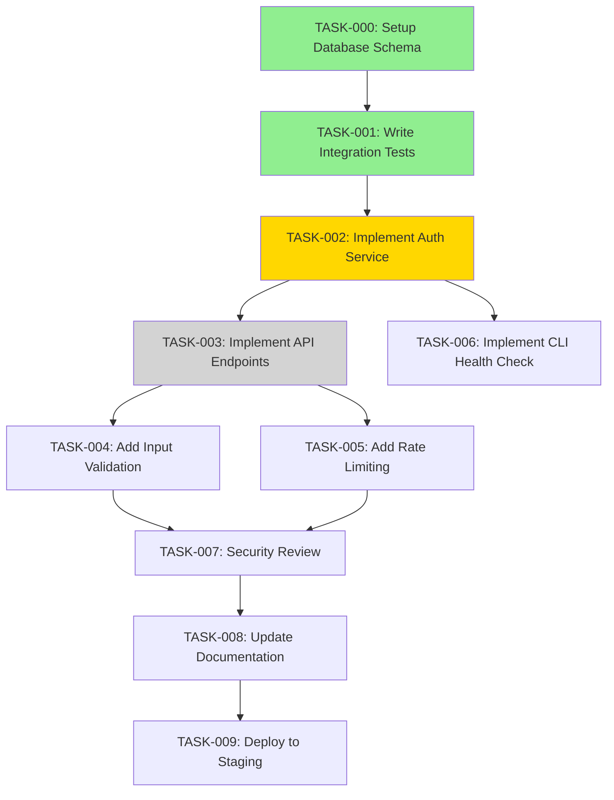

# Task Breakdown: [Feature Name]

<!--
INSTRUCTIONS:
- This is a Phase 0 document (Planning/Execution phase)
- Must link to parent PLAN-NNN
- Break down plan into atomic, executable tasks
- Assign execution mode (Human/Copilot/Challenger)
- Map dependencies clearly
- Track progress as tasks complete
-->

---

## Frontmatter

```yaml
tasks_id: TASKS-NNNN                  # Same number as parent plan
title: [Feature Name - Task Breakdown]
version: 1.0.0                        # Semantic version
status: Not Started                   # Not Started | In Progress | Completed
author: [Your Name]                   # Task breakdown author
created_date: YYYY-MM-DD
last_updated: YYYY-MM-DD
parent_plan: PLAN-NNNN                # Link to parent technical plan
parent_spec: SPEC-NNNN                # Link to original specification
total_tasks: 0                        # Auto-count as you add
completed_tasks: 0                    # Update as tasks complete
constitutional_version: 1.0.0
```

---

## Constitutional Compliance Checklist

<!-- Article I: Traceability & Linkage -->
- [ ] **Traceability (Article I)**: Linked to PLAN-NNNN and SPEC-NNNN
- [ ] **Task-to-Code Mapping**: Each task will reference source files produced
- [ ] **Bidirectional Links**: Tasks reference plan, plan references tasks

<!-- Article II: Stage Gate Discipline -->
- [ ] **Phase 0 Planning**: Tasks are atomic and testable
- [ ] **Entry Criteria**: Parent plan (PLAN-NNNN) approved and Phase -1 gates passed

<!-- Article III: Test-First Engineering -->
- [ ] **Test Tasks First**: Test-writing tasks appear before implementation tasks
- [ ] **Test Coverage**: Each user story has corresponding test tasks

<!-- Article IV: Challenger Mode -->
- [ ] **Challenger Tasks**: Security/quality reviews assigned to Challenger mode
- [ ] **Adversarial Review**: Critical paths include Challenger verification

<!-- Article IX: Documentation Sync -->
- [ ] **Documentation Tasks**: Tasks include updating docs alongside code
- [ ] **Last Updated**: Timestamp maintained as tasks progress

---

## Task Breakdown Summary

### Progress Overview

```
Total Tasks: XX
Completed: XX (XX%)
In Progress: XX (XX%)
Blocked: XX (XX%)
Not Started: XX (XX%)
```

### Status Legend

- ✅ **Completed**: Task done, tests passing, code reviewed
- ⏳ **In Progress**: Currently being worked on
- 🚫 **Blocked**: Cannot proceed due to dependency
- ⏸️ **Not Started**: Ready but not yet begun
- ⚠️ **At Risk**: Behind schedule or encountering issues

### Execution Mode Legend

- 👤 **Human**: Requires human judgment, creativity, or domain expertise
- 🤖 **Copilot**: Can be executed by AI agent with human review
- 🛡️ **Challenger**: AI agent in adversarial review mode
- 👥 **Pair**: Human + AI working together

---

## Task Dependency Graph



**Legend**: 
- 🟢 Green = Completed
- 🟡 Yellow = In Progress  
- ⚪ Gray = Not Started
- 🔴 Red = Blocked

---

## Tasks

### TASK-000: Setup Database Schema

**Status**: ✅ Completed  
**Execution Mode**: 👤 Human  
**Assigned To**: [Backend Engineer Name]  
**Priority**: High (Critical Path)  
**Estimated Effort**: 2 hours  
**Actual Effort**: 1.5 hours  

**Traceability**:
- **Specification**: SPEC-NNNN → US-001 (User Login)
- **Plan**: PLAN-NNNN → Data Models → User Model
- **Source Files**: 
  - `migrations/001_create_users_table.sql`
  - `migrations/002_add_indexes.sql`

**Description**:
Create PostgreSQL database schema for user authentication, including users table, indexes, and constraints.

**Acceptance Criteria**:
- [x] Users table created with all fields from data model
- [x] Unique constraint on email column
- [x] Indexes on email and is_active columns
- [x] Migration script is idempotent (can run multiple times safely)
- [x] Migration tested on local database
- [x] Schema validated against plan data model

**Dependencies**:
- None (starting task)

**Implementation Notes**:
- Used PostgreSQL UUID extension for id generation
- Added created_at/updated_at triggers for automatic timestamp updates
- Verified migrations rollback cleanly

**Verification**:
```bash
# Run migration
psql -U user -d myapp < migrations/001_create_users_table.sql

# Verify schema
psql -U user -d myapp -c "\d users"
```

**Pull Request**: #123  
**Completed**: 2024-01-15

---

### TASK-001: Write Integration Tests for Login Flow

**Status**: ⏳ In Progress  
**Execution Mode**: 🤖 Copilot (with Human review)  
**Assigned To**: [Engineer Name] + GitHub Copilot  
**Priority**: High (Test-First requirement)  
**Estimated Effort**: 4 hours  
**Actual Effort**: TBD  

**Traceability**:
- **Specification**: SPEC-NNNN → US-001 (User Login)
- **Plan**: PLAN-NNNN → Integration Test Scenarios → Test 1, Test 2, Test 3
- **Source Files**: 
  - `tests/integration/test_auth_login.py`
  - `tests/fixtures/test_users.py`

**Description**:
Implement integration tests for complete login flow before writing any authentication code. Tests should initially fail (Red phase of TDD).

**Acceptance Criteria**:
- [x] Test for successful login with valid credentials
- [x] Test for failed login with invalid password
- [x] Test for failed login with non-existent email
- [ ] Test for rate limiting (5 attempts per minute)
- [ ] Test for token expiration (30 minutes)
- [ ] Test for accessing protected endpoint with valid token
- [ ] Test for accessing protected endpoint with expired token
- [ ] All tests are currently FAILING (Red phase - expected)
- [ ] Test fixtures create/cleanup test data properly
- [ ] Tests can run in parallel without conflicts

**Dependencies**:
- TASK-000 (Database schema must exist)

**Implementation Notes**:
Currently writing test cases. Using pytest for test framework and fixtures for test data management.

**Test Example**:
```python
def test_login_success(test_client, test_user):
    """Test successful login with valid credentials."""
    response = test_client.post("/api/auth/login", json={
        "email": "test@example.com",
        "password": "SecurePass123!"
    })
    assert response.status_code == 200
    assert "token" in response.json()
    assert "expires_at" in response.json()
```

**Next Steps**:
- Complete rate limiting test
- Complete token expiration test
- Verify all tests fail as expected

**Pull Request**: #124 (Draft)

---

### TASK-002: Implement Auth Service Core Logic

**Status**: ⏸️ Not Started  
**Execution Mode**: 🤖 Copilot (with Human review)  
**Assigned To**: [Backend Engineer]  
**Priority**: High (Critical Path)  
**Estimated Effort**: 6 hours  

**Traceability**:
- **Specification**: SPEC-NNNN → US-001
- **Plan**: PLAN-NNNN → Architecture → Auth Service
- **Source Files**: 
  - `src/auth/service.py`
  - `src/auth/models.py`
  - `src/auth/crypto.py`

**Description**:
Implement core authentication service logic: password hashing with bcrypt, JWT token generation, user validation.

**Acceptance Criteria**:
- [ ] `validate_credentials(email, password)` function implemented
- [ ] Password hashing uses bcrypt with cost factor 12
- [ ] JWT token generation with 30-minute expiration
- [ ] Token includes user_id and email in claims
- [ ] Token verification function implemented
- [ ] All functions have type hints
- [ ] Unit tests for each function pass
- [ ] Integration tests from TASK-001 now pass (Green phase)
- [ ] Code follows project style guide
- [ ] No secrets hardcoded

**Dependencies**:
- TASK-001 (Integration tests must be written first)

**Implementation Guidance**:
```python
# Expected function signatures
def hash_password(password: str) -> str:
    """Hash password using bcrypt."""
    pass

def verify_password(password: str, password_hash: str) -> bool:
    """Verify password against hash."""
    pass

def generate_token(user_id: UUID, email: str) -> dict:
    """Generate JWT token with claims."""
    pass

def verify_token(token: str) -> dict:
    """Verify and decode JWT token."""
    pass
```

**Risk**: Medium - JWT security is critical, requires careful review

---

### TASK-003: Implement REST API Endpoints

**Status**: ⏸️ Not Started  
**Execution Mode**: 🤖 Copilot  
**Assigned To**: [Backend Engineer]  
**Priority**: High  
**Estimated Effort**: 4 hours  

**Traceability**:
- **Specification**: SPEC-NNNN → US-001
- **Plan**: PLAN-NNNN → API Contracts
- **Source Files**: 
  - `src/api/auth.py`
  - `src/api/middleware.py`

**Description**:
Implement FastAPI endpoints for authentication: POST /api/auth/login, GET /api/auth/me, POST /api/auth/logout.

**Acceptance Criteria**:
- [ ] POST /api/auth/login endpoint implemented per API contract
- [ ] GET /api/auth/me endpoint with token validation
- [ ] POST /api/auth/logout endpoint
- [ ] OpenAPI documentation auto-generated
- [ ] Endpoints return correct HTTP status codes
- [ ] Error responses follow standard format
- [ ] Request/response logging implemented
- [ ] HTTPS enforced (reject HTTP)
- [ ] CORS configured appropriately

**Dependencies**:
- TASK-002 (Auth service logic must exist)

**API Contract Reference**:
See PLAN-NNNN → API Contracts section for request/response formats.

---

### TASK-004: Implement Input Validation

**Status**: ⏸️ Not Started  
**Execution Mode**: 🤖 Copilot  
**Assigned To**: [Backend Engineer]  
**Priority**: High (Security requirement)  
**Estimated Effort**: 3 hours  

**Traceability**:
- **Specification**: SPEC-NNNN → NFR → Security
- **Plan**: PLAN-NNNN → Security Considerations → Input Validation
- **Source Files**: 
  - `src/auth/validation.py`
  - `src/auth/schemas.py`

**Description**:
Implement comprehensive input validation for all authentication endpoints to prevent injection attacks and ensure data quality.

**Acceptance Criteria**:
- [ ] Email validation (RFC 5322 format, max 255 chars)
- [ ] Password complexity validation (min 8 chars, uppercase, lowercase, number, special)
- [ ] Name validation (1-100 chars, allowed characters only)
- [ ] Sanitization of all inputs (trim whitespace, lowercase email)
- [ ] Validation errors return 400 with field-level error messages
- [ ] All validation rules match PLAN-NNNN specifications
- [ ] Unit tests for each validation rule
- [ ] Validation prevents SQL injection (use parameterized queries)
- [ ] Validation prevents XSS (escape HTML entities)

**Dependencies**:
- TASK-003 (API endpoints must exist)

**Validation Examples**:
```python
from pydantic import BaseModel, EmailStr, constr

class LoginRequest(BaseModel):
    email: EmailStr
    password: constr(min_length=8, max_length=100)
```

**Risk**: High - Input validation is critical for security

---

### TASK-005: Implement Rate Limiting

**Status**: ⏸️ Not Started  
**Execution Mode**: 🤖 Copilot  
**Assigned To**: [Backend Engineer]  
**Priority**: High (Security requirement)  
**Estimated Effort**: 4 hours  

**Traceability**:
- **Specification**: SPEC-NNNN → NFR → Security → Rate Limiting
- **Plan**: PLAN-NNNN → API Contracts → Rate Limiting
- **Source Files**: 
  - `src/middleware/rate_limiter.py`
  - `src/cache/redis_client.py`

**Description**:
Implement rate limiting to prevent brute-force login attacks: 5 attempts per minute per IP, 10 attempts per hour per email.

**Acceptance Criteria**:
- [ ] Rate limiting middleware implemented
- [ ] 5 requests per minute per IP address enforced
- [ ] 10 requests per hour per email address enforced
- [ ] Rate limit counters stored in Redis with TTL
- [ ] 429 Too Many Requests returned when limit exceeded
- [ ] Response includes `Retry-After` header
- [ ] Rate limits reset after specified time
- [ ] Integration test for rate limiting passes
- [ ] Rate limit configuration is environment-variable driven

**Dependencies**:
- TASK-003 (API endpoints must exist)
- Redis must be available

**Implementation Notes**:
- Use Redis INCR with EXPIRE for atomic counter operations
- Key format: `ratelimit:ip:<ip_address>` and `ratelimit:email:<email>`

**Risk**: Medium - Rate limiting must not block legitimate users

---

### TASK-006: Implement CLI Health Check Interface

**Status**: ⏸️ Not Started  
**Execution Mode**: �� Copilot  
**Assigned To**: [Backend Engineer]  
**Priority**: Medium (Observability requirement)  
**Estimated Effort**: 3 hours  

**Traceability**:
- **Specification**: SPEC-NNNN → NFR → Observability
- **Plan**: PLAN-NNNN → Observability Plan → CLI Interface
- **Source Files**: 
  - `src/cli/health.py`
  - `src/cli/main.py`

**Description**:
Implement CLI commands for health checking and observability per Article VII requirements.

**Acceptance Criteria**:
- [ ] `myapp health` command implemented
- [ ] Health check tests database connectivity
- [ ] Health check tests Redis connectivity
- [ ] Health check tests external dependencies (SMTP)
- [ ] Exit code 0 for healthy, non-zero for unhealthy
- [ ] Output format matches PLAN-NNNN specification
- [ ] CLI uses Click or Typer framework
- [ ] Health endpoint also exposed as GET /health for load balancers

**Dependencies**:
- TASK-002 (Auth service must exist to check)

**CLI Example**:
```bash
$ myapp health
Status: Healthy
Database: Connected (5ms)
Redis: Connected (2ms)
Exit code: 0
```

---

### TASK-007: Security Review (Challenger Mode)

**Status**: ⏸️ Not Started  
**Execution Mode**: 🛡️ Challenger (AI in adversarial mode)  
**Assigned To**: [Security Engineer] or GitHub Copilot Challenger  
**Priority**: Critical (Cannot deploy without)  
**Estimated Effort**: 4 hours  

**Traceability**:
- **Specification**: SPEC-NNNN → NFR → Security
- **Plan**: PLAN-NNNN → Security Considerations
- **Source Files**: All authentication code

**Description**:
Perform adversarial security review of authentication implementation, attempting to find vulnerabilities.

**Acceptance Criteria**:
- [ ] Review checklist completed (see below)
- [ ] Automated SAST scan run (CodeQL, Semgrep)
- [ ] Dependency vulnerability scan run (Snyk, Dependabot)
- [ ] Manual code review for security issues
- [ ] All High/Critical findings addressed
- [ ] Security test cases added for identified risks
- [ ] Challenger sign-off obtained

**Security Review Checklist**:
- [ ] No SQL injection vulnerabilities (parameterized queries used)
- [ ] No XSS vulnerabilities (input sanitized, output escaped)
- [ ] No CSRF vulnerabilities (appropriate for stateless API)
- [ ] Authentication bypass not possible
- [ ] Authorization checks present at all endpoints
- [ ] Secrets not hardcoded or logged
- [ ] Password hashing uses strong algorithm (bcrypt)
- [ ] JWT tokens cannot be forged
- [ ] Rate limiting works as specified
- [ ] Account enumeration not possible (error messages are generic)
- [ ] Timing attacks prevented (constant-time comparison)
- [ ] Session fixation not possible

**Dependencies**:
- TASK-002, TASK-003, TASK-004, TASK-005 (All security-critical code complete)

**Challenger Questions**:
- What happens if an attacker sends 1000 requests simultaneously?
- Can token be reused after logout?
- What if Redis is down during login?
- Can attacker enumerate valid email addresses?
- Is there a timing attack in password verification?

**Output**: Security review report with findings and mitigations

---

### TASK-008: Update Documentation

**Status**: ⏸️ Not Started  
**Execution Mode**: 👤 Human (with Copilot assistance)  
**Assigned To**: [Technical Writer / Engineer]  
**Priority**: High (Article IX requirement)  
**Estimated Effort**: 3 hours  

**Traceability**:
- **Specification**: SPEC-NNNN
- **Plan**: PLAN-NNNN
- **Source Files**: 
  - `README.md`
  - `docs/api/authentication.md`
  - `docs/deployment/setup.md`

**Description**:
Update all documentation to reflect implemented authentication feature, ensuring docs are synchronized with code per Article IX.

**Acceptance Criteria**:
- [ ] README.md updated with authentication setup instructions
- [ ] API documentation includes authentication endpoints
- [ ] Code examples provided for login flow
- [ ] Environment variables documented
- [ ] Troubleshooting section added
- [ ] Architecture diagrams updated
- [ ] All documentation links verified (no broken links)
- [ ] "Last Updated" timestamps added to all docs
- [ ] "Last Synced With Code" includes commit hash

**Dependencies**:
- TASK-007 (Security review complete, no major changes expected)

**Documentation Sections to Update**:
1. Getting Started → Add authentication setup
2. API Reference → Add /api/auth/* endpoints
3. Configuration → Add auth-related env vars
4. Deployment → Add database migration steps
5. Troubleshooting → Add common auth issues

---

### TASK-009: Deploy to Staging Environment

**Status**: ⏸️ Not Started  
**Execution Mode**: 👤 Human  
**Assigned To**: [DevOps Engineer]  
**Priority**: High (Final validation)  
**Estimated Effort**: 2 hours  

**Traceability**:
- **Specification**: SPEC-NNNN
- **Plan**: PLAN-NNNN → Deployment Strategy
- **Source Files**: 
  - `deploy/staging.yaml`
  - `migrations/*.sql`

**Description**:
Deploy authentication feature to staging environment for final validation before production.

**Acceptance Criteria**:
- [ ] Database migrations run successfully
- [ ] Application deployed to staging
- [ ] Health check returns healthy status
- [ ] Integration tests pass against staging environment
- [ ] Load test completed (1000 req/sec for 5 minutes)
- [ ] Smoke test completed (manual testing of key flows)
- [ ] Monitoring dashboards configured
- [ ] Logs flowing to centralized logging system
- [ ] Rollback plan tested

**Dependencies**:
- TASK-008 (Documentation complete for deployment reference)
- All previous tasks complete

**Deployment Steps**:
1. Backup staging database
2. Run database migrations
3. Deploy application code
4. Run health checks
5. Run integration test suite
6. Perform load testing
7. Monitor for errors (24 hours)

**Success Criteria**:
- Zero errors in 24-hour monitoring period
- All integration tests pass
- Load test meets performance requirements (p95 < 200ms)

---

### TASK-010: Production Deployment (Future)

**Status**: ⏸️ Not Started  
**Execution Mode**: 👤 Human  
**Assigned To**: [DevOps Engineer]  
**Priority**: High  
**Estimated Effort**: 4 hours  

**Traceability**:
- **Specification**: SPEC-NNNN
- **Plan**: PLAN-NNNN → Deployment Strategy

**Description**:
Deploy authentication feature to production with phased rollout using feature flags.

**Acceptance Criteria**:
- [ ] Feature flag configured (start at 0%)
- [ ] Database migrations run in maintenance window
- [ ] Application deployed to production
- [ ] Feature flag enabled for 5% of users (Beta)
- [ ] Monitoring for 48 hours, no critical issues
- [ ] Feature flag increased to 100%
- [ ] Feature flag removed after 1 week of stable operation
- [ ] Post-deployment review completed

**Dependencies**:
- TASK-009 (Staging deployment successful)
- Stakeholder approval for production deployment

---

## Task Execution Guidelines

### For Human Tasks (👤)

1. Review traceability links to understand context
2. Check acceptance criteria before starting
3. Write tests first (if applicable)
4. Implement solution
5. Run tests to verify
6. Request code review
7. Update task status and actual effort
8. Link pull request in task

### For Copilot Tasks (🤖)

1. Provide Copilot with:
   - Task description
   - Acceptance criteria
   - Relevant code context
   - API contracts or schemas
2. Review Copilot's output carefully
3. Run tests to verify correctness
4. Refactor if needed for clarity
5. Approve and merge after human review

**Example Copilot Prompt**:
```
Implement TASK-004: Input Validation for authentication API.

Context:
- Using FastAPI with Pydantic models
- Email must be valid RFC 5322 format, max 255 chars
- Password min 8 chars, must have uppercase, lowercase, number, special char
- See PLAN-NNNN for complete validation rules

Acceptance Criteria:
[paste criteria from task]

Generate code for src/auth/validation.py and src/auth/schemas.py
```

### For Challenger Tasks (🛡️)

1. Provide Copilot with adversarial prompt
2. Review code attempting to find flaws
3. Document findings in Challenger review section
4. Author addresses findings
5. Re-review until all critical findings resolved

**Example Challenger Prompt**:
```
Act as a security Challenger reviewing authentication code.
Your goal is to find vulnerabilities, not approve the code.

Review src/auth/ for:
- SQL injection vulnerabilities
- Authentication bypass possibilities
- Timing attacks
- Information leakage
- Rate limiting bypasses

Be adversarial and thorough. List all findings with severity.
```

---

## Progress Tracking

### Sprint / Week View

**Week 1** (YYYY-MM-DD to YYYY-MM-DD):
- [x] TASK-000: Setup Database Schema
- [x] TASK-001: Write Integration Tests
- [ ] TASK-002: Implement Auth Service (In Progress)

**Week 2** (YYYY-MM-DD to YYYY-MM-DD):
- [ ] TASK-003: Implement REST API Endpoints
- [ ] TASK-004: Implement Input Validation
- [ ] TASK-005: Implement Rate Limiting

**Week 3** (YYYY-MM-DD to YYYY-MM-DD):
- [ ] TASK-006: Implement CLI Health Check
- [ ] TASK-007: Security Review (Challenger)
- [ ] TASK-008: Update Documentation
- [ ] TASK-009: Deploy to Staging

---

## Risk & Issues Log

| Issue ID | Description | Severity | Status | Resolution |
|----------|-------------|----------|--------|------------|
| I-001 | Redis connection unstable in dev environment | Medium | Open | DevOps investigating |
| I-002 | bcrypt performance slower than expected | Low | Resolved | Cost factor acceptable |
| I-003 | Rate limiting test flaky | High | Open | Investigating race condition |

---

## Retrospective Notes

**What Went Well**:
- [Add after task completion]

**What Could Be Improved**:
- [Add after task completion]

**Action Items**:
- [Add after task completion]

---

## Approval

### Task Breakdown Review

| Date | Reviewer | Role | Status | Comments |
|------|----------|------|--------|----------|
| YYYY-MM-DD | [Name] | Tech Lead | Approved | Tasks are well-defined |
| YYYY-MM-DD | [Name] | Product Owner | Approved | Aligns with spec |

**This task breakdown is approved for execution.**

---

## Version History

| Version | Date | Author | Changes |
|---------|------|--------|---------|
| 1.0.0 | YYYY-MM-DD | [Name] | Initial task breakdown |
| 1.1.0 | YYYY-MM-DD | [Name] | Updated based on team feedback |

---

## Traceability

**Upstream Documents**:
- SPEC-NNNN: [Feature Name Specification]
- PLAN-NNNN: [Feature Name Technical Plan]

**Source Code** (updated as tasks complete):
- `src/auth/` → TASK-002, TASK-003, TASK-004
- `tests/integration/` → TASK-001
- `migrations/` → TASK-000

**Pull Requests**:
- PR #123: TASK-000 (Merged)
- PR #124: TASK-001 (In Review)

**Last Synced With Code**: [Commit hash]

---

**End of Task Breakdown**

<!--
Workflow:
1. Review tasks with team
2. Assign tasks to engineers
3. Track progress daily
4. Update status and actual effort
5. Link PRs as tasks complete
6. Sync documentation when code changes
-->
# SWAIF Tasks Template

> Template owner: Delivery Lead / Team Leads.
> Expected inputs: approved plan, milestone dates, team ownership map, and risk mode.

## Task Set Metadata

- **Task Set ID**: `TASKS-YYYY-NNN`
- **Plan reference**: `[path/uri]`
- **Execution mode**: `[sequential|parallel|hybrid]`
- **Owner**: `[name/role]`
- **Status**: `draft`

## Task Structure

Use one task per independently reviewable unit with explicit completion evidence.

| Task ID | Title | Description | Owner | Estimate | Definition of Done |
|---|---|---|---|---|---|
| T-001 | `[task title]` | `[what + why]` | `[name/role]` | `[size/time]` | `[artifact/test/proof]` |
| T-002 | `[task title]` | `[what + why]` | `[name/role]` | `[size/time]` | `[artifact/test/proof]` |

## Execution Modes

### Sequential Mode
- Use when outputs from one task are strict prerequisites for the next.
- Typical for schema migrations, regulatory reviews, or contract-first dependencies.

### Parallel Mode
- Use when tasks can proceed independently with minimal coupling.
- Typical for UI/backend split work, isolated components, or documentation tracks.

### Hybrid Mode
- Use when foundational tasks must complete first, then fan out to parallel streams.
- Typical for architecture baseline + implementation branches.

## Dependency Mapping

| Task ID | Depends On | Blocking Reason | Unblock Criteria |
|---|---|---|---|
| T-002 | T-001 | `[reason]` | `[criteria]` |

## Risk-Aware Work Controls

- **High-risk tasks**: `[task ids]`
- **Required reviewers**: `[security/architecture/ops/etc.]`
- **Additional controls**: `[pairing, extra tests, staged rollout]`

## Traceability Matrix

> Ensure every task maps back to a plan section and spec requirement.

| Task ID | Plan Section | Spec Requirement | Constitution / Control Link | Evidence |
|---|---|---|---|---|
| T-001 | `[section]` | `[req-id]` | `[article/control]` | `[test/doc/link]` |

## Execution Log (Optional)

- `[YYYY-MM-DD] T-001 started/completed; notes`
- `[YYYY-MM-DD] T-002 blocked/unblocked; notes`
